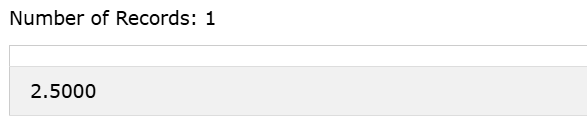
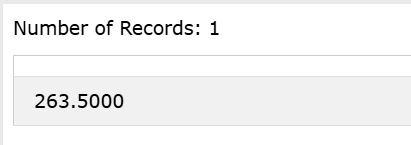
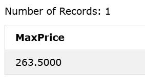
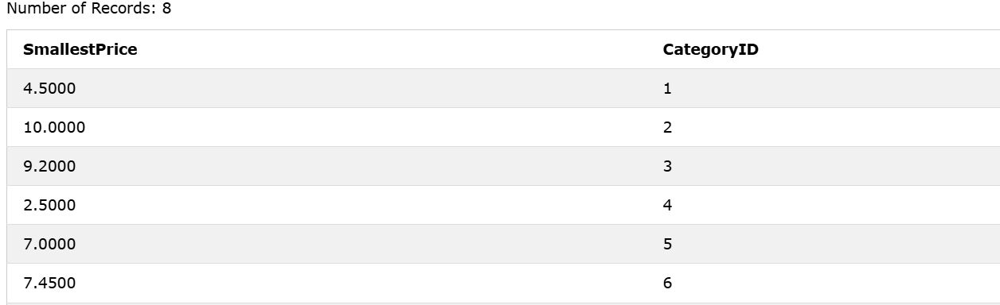

### SQL Aggregate Functions
An `aggregate function` is a function that performs a calculation on a set of values, and returns a single value.

`Aggregate` functions are often used with the `GROUP BY`clause of the `SELECT` statement. The `GROUP BY` clause splits the result-set into groups of values and the aggregate function can be used to return a single value for each group.

### The most commonly used SQL aggregate functions are:
MIN() - returns the smallest value within the selected column
MAX() - returns the largest value within the selected column
COUNT() - returns the number of rows in a set
SUM() - returns the total sum of a numerical column
AVG() - returns the average value of a numerical column

### Note: Aggregate functions ignore null values (except for COUNT(*)).

### The SQL MIN() and MAX() Functions:

The `MIN()` function returns the smallest value of the selected column.
The `MAX()` function returns the largest value of the selected column.

### MIN Syntax
```sql
SELECT MIN(column_name) FROM table_name WHERE condition;
```  

### MIN Example:
Find the lowest price in the Price column:

```sql
SELECT MIN(Price) FROM Products;
```

### MIN Output: 



### MAX Syntax
```sql
SELECT MAX(column_name) FROM table_name WHERE condition;
```  

### MAX Example:
Find the Highest price in the Price column:

```sql
SELECT MAX(Price) FROM Products;
```

### MAX Output: 


----------


### Set Column Name (Alias)
When you use `MIN()` or` MAX()`, the returned column will not have a descriptive name. To give the column a descriptive name, use the `AS` keyword:

### MAX Example:
```sql
SELECT MAX(Price) AS MaxPrice FROM Products;
```

### MAX Output: 


----------

### Use MIN() with GROUP BY
Here we use the MIN() function and the GROUP BY clause, to return the smallest price for each category in the Products table:

### MIN With GROUP BY Example:
```sql
SELECT MIN(Price) AS SmallestPrice, CategoryID FROM Products
GROUP BY CategoryID;
```

### Output: 


----------


