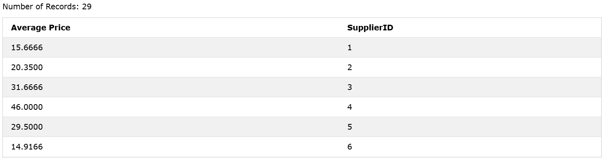
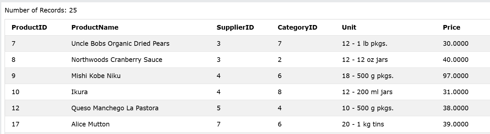

### The SQL AVG() Function
The AVG() function returns the average value of a numeric column.
`Note`: NULL values are ignored.

### Syntax
```sql
SELECT AVG(column_name) FROM table_name WHERE condition;
```  

### Example: 
```sql
SELECT AVG(Price) AS [Average Price], SupplierID FROM Products GROUP BY SupplierID;
```

### Output: 



### Example 2: To list all records with a higher price than average, we can use the AVG() function in a sub query:
```sql
SELECT * FROM Products WHERE price > (SELECT AVG(Price) FROM Products);
```

### Output: 
