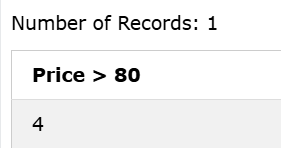
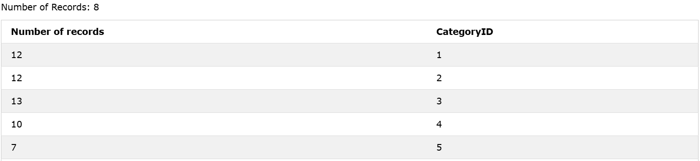

### The SQL COUNT() Function
The `COUNT()` function returns the number of rows that matches a specified criterion.

### Syntax
```sql
SELECT COUNT(column_name) FROM table_name WHERE condition;
```  

### Example: Find the total number of rows in the Products table:

```sql
SELECT COUNT(DISTINCT ProductName) AS [Price > 80]
FROM Products WHERE Price > 80;
```
<!-- DISTINCT: Ensure Unique Result -->

### Output: 



### Use COUNT() with GROUP BY
Here we use the `COUNT()` function and the `GROUP BY` clause, to return the number of records for each category in the Products table:

### Example
```sql
SELECT COUNT(*) AS [Number of records], CategoryID
FROM Products
GROUP BY CategoryID;
```

### Output: 
