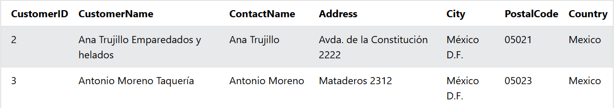

### The SQL DELETE Statement
The DELETE statement is used to delete existing records in a table.

### Note: Be careful when deleting records in a table! Notice the WHERE clause in the DELETE statement. The WHERE clause specifies which record(s) should be deleted. If you omit the WHERE clause, all records in the table will be deleted!

### Syntax
```sql
DELETE FROM table_name WHERE condition;
```  

### Example: The following SQL statement deletes the customer "Alfreds Futterkiste" from the "Customers" table:

```sql
DELETE FROM Customers WHERE CustomerName='Alfreds Futterkiste';
```

### Output: 


----------


### Delete All Records
It is possible to delete all rows in a table without deleting the table. This means that the table structure, attributes, and indexes will be intact:

### Example: The following SQL statement deletes all rows in the "Customers" table, without deleting the table:
```sql
DELETE FROM Customers;
```
----------


### Delete a Table
To delete the table completely, use the DROP TABLE statement:

### Example: Remove the Customers table:

```sql
DROP TABLE Customers;
```
----------