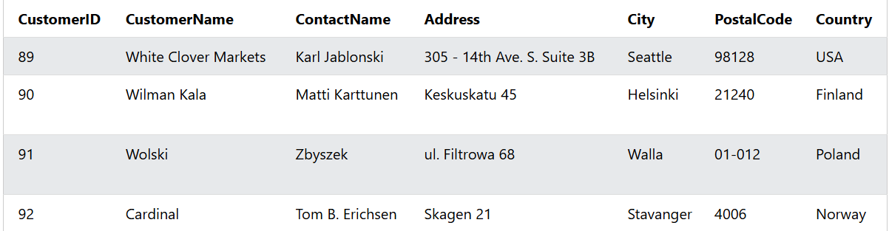
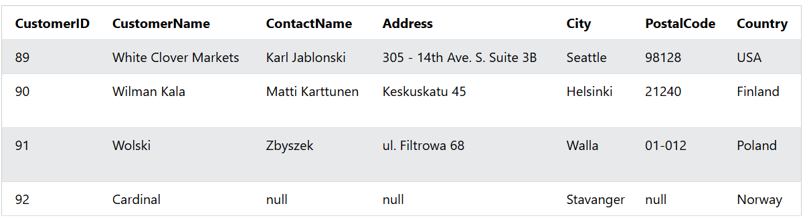
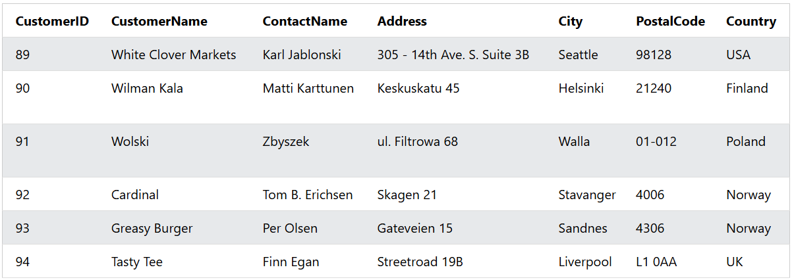

### The SQL INSERT INTO Statement
The `INSERT INTO` statement is used to insert new records in a table.

### INSERT INTO Syntax
It is possible to write the INSERT INTO statement in two ways:

### Syntax 1
1. Specify both the column names and the values to be inserted:

```sql
INSERT INTO table_name (column1, column2, column3, ...)
VALUES (value1, value2, value3, ...);
```  

### Syntax 2
2. If you are adding values for all the columns of the table, you do not need to specify the column names in the SQL query. However, make sure the order of the values is in the same order as the columns in the table. Here, the INSERT INTO syntax would be as follows:

```sql
INSERT INTO table_name
VALUES (value1, value2, value3, ...);
```  

### Example: The following SQL statement inserts a new record in the "Customers" table:

```sql
INSERT INTO Customers (CustomerName, ContactName, Address, City, PostalCode, Country)
VALUES ('Cardinal', 'Tom B. Erichsen', 'Skagen 21', 'Stavanger', '4006', 'Norway');
```

### Output: 


----------


### Insert Data Only in Specified Columns
It is also possible to only insert data in specific columns.

The following SQL statement will insert a new record, but only insert data in the "CustomerName", "City", and "Country" columns (CustomerID will be updated automatically):

### Example:
```sql
INSERT INTO Customers (CustomerName, City, Country)
VALUES ('Cardinal', 'Stavanger', 'Norway');
```

### Output: 


----------


### Insert Multiple Rows:
It is also possible to insert multiple rows in one statement.
To insert multiple rows of data, we use the same INSERT INTO statement, but with multiple values:

### Example: 

```sql
INSERT INTO Customers (CustomerName, ContactName, Address, City, PostalCode, Country)
VALUES
('Cardinal', 'Tom B. Erichsen', 'Skagen 21', 'Stavanger', '4006', 'Norway'),
('Greasy Burger', 'Per Olsen', 'Gateveien 15', 'Sandnes', '4306', 'Norway'),
('Tasty Tee', 'Finn Egan', 'Streetroad 19B', 'Liverpool', 'L1 0AA', 'UK');
```

### Output: 


----------
