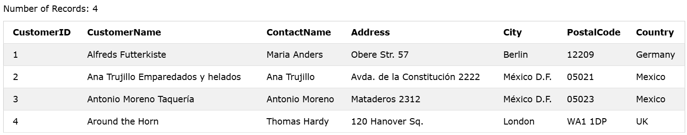
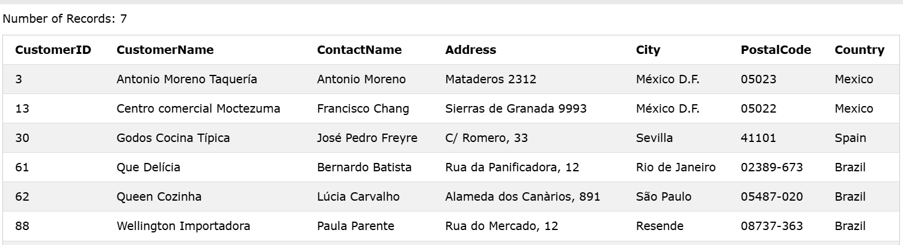
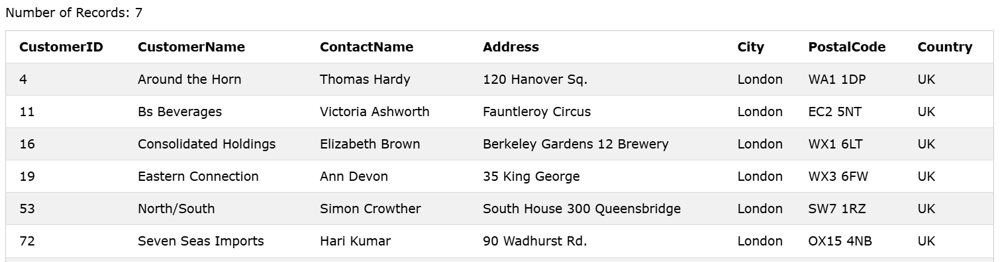
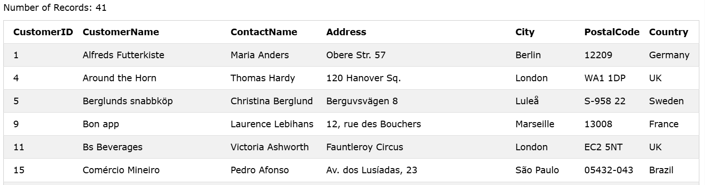
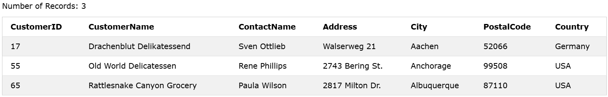
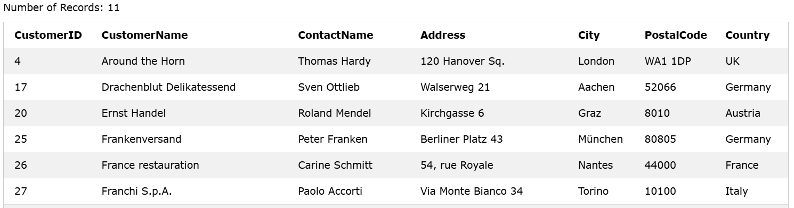
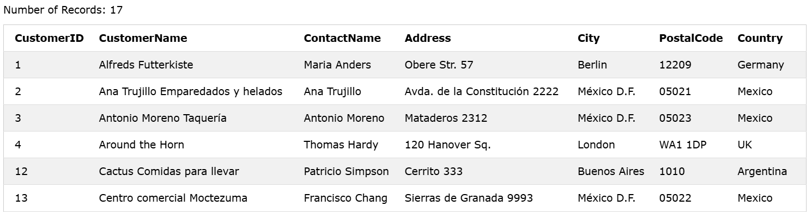
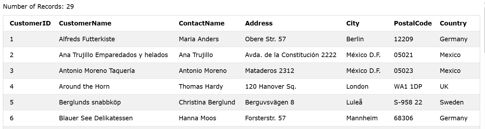

### The SQL LIKE Operator
The `LIKE` operator is used in a `WHERE` clause to search for a `specified pattern` in a column.

There are two `wildcards` often used in conjunction with the `LIKE` operator:
The `percent sign (%)` represents zero, one, space or multiple characters
The `underscore sign (_)` represents one, space, single character

### Syntax
```sql
SELECT column1, column2, ... FROM table_name
WHERE columnN LIKE pattern;
```  

### Example: Select all customers that starts with the letter "a":
```sql
SELECT * FROM Customers WHERE CustomerName LIKE 'a%';
```

### Output: 


--------

### Example: Select all customers that ends with the letter "a":
```sql
SELECT * FROM Customers WHERE CustomerName LIKE '%a';
```

### Output: 


--------

### The _ Wildcard
The `_ wildcard` represents a single character.
It can be any character or number, but each `_` represents one, and only one, character.

### Example: Return all customers from a city that starts with 'L' followed by one wildcard character, then 'nd' and then two wildcard characters:
```sql
SELECT * FROM Customers WHERE City LIKE 'L_nd__';
```

### Output: 


--------

### Example: Return all customers from a city that contains the letter 'L':
```sql
SELECT * FROM Customers WHERE City LIKE '%L%';
```

### Output: 


--------


### Example: Return all customers that starts with "a" and are at least 3 characters in length:
```sql
SELECT * FROM Customers WHERE City LIKE 'a__%';
```
### Output: 


--------

### Example: Return all customers that have "r" in the second position:
```sql
SELECT * FROM Customers WHERE CustomerName LIKE '_r%';
```
### Output: 


--------

### Example: Return all customers starting with either "a", "c", or "f":
```sql
SELECT * FROM Customers WHERE CustomerName LIKE '[acf]%';
```
### Output: 


--------

### Example: Return all customers starting with "a", "b", "c", "d", "e" or "f":
```sql
SELECT * FROM Customers WHERE CustomerName LIKE '[a-f]%';
```
### Output: 


--------