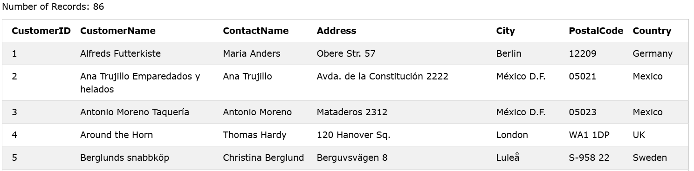
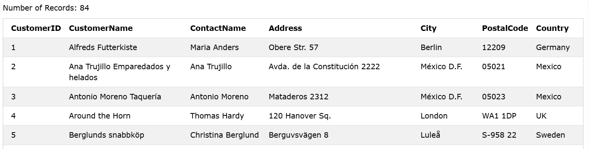
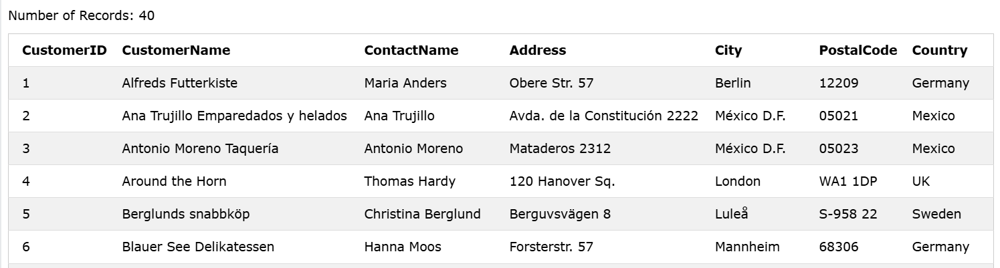
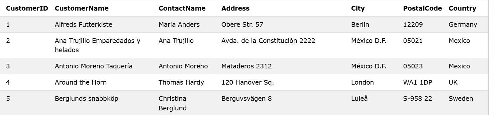
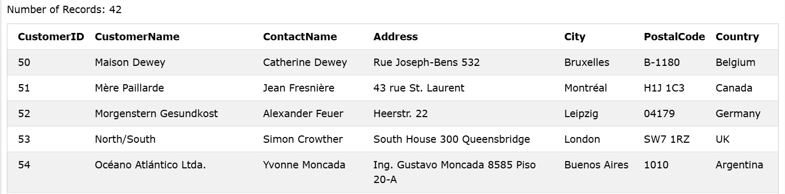

### The NOT Operator
The NOT operator is used in combination with other operators to give the opposite result, also called the negative result.
In the select statement below we want to return all customers that are NOT from Spain:

### Syntax
```sql
SELECT column1, column2, ...
FROM table_name
WHERE NOT condition;
```  

### Example: Select only the customers that are NOT from Spain:

```sql
SELECT * FROM Customers
WHERE NOT Country = 'Spain';
```

### Output: 


----------


### NOT LIKE:

### Example: Select customers that does not start with the letter 'S':

```sql
SELECT * FROM Customers
WHERE CustomerName NOT LIKE 'S%';
```

### Output: 


----------


### NOT BETWEEN:

### Example: Select customers with a customerID not between 10 and 60:

```sql
SELECT * FROM Customers WHERE customerID NOT BETWEEN 10 AND 60;
```

### Output: 


----------


### NOT Greater Than:

### Example: Select customers with a CustomerId not greater than 50:


```sql
SELECT * FROM Customers WHERE NOT CustomerID > 50;
```

### Output: 


----------


### NOT Less Than:

### Example: Select customers with a CustomerID not less than 50:

```sql
SELECT * FROM Customers WHERE NOT CustomerID < 50;
```

### Output: 


----------