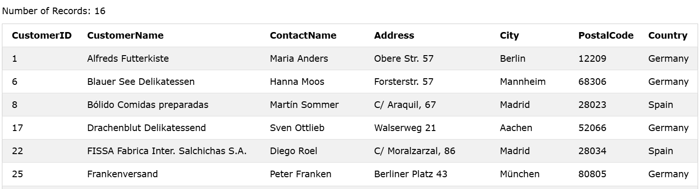
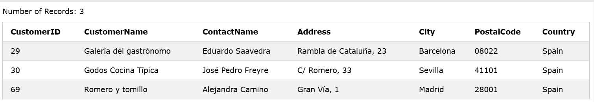

### The SQL OR Operator
The WHERE clause can contain one or more OR operators.

The OR operator is used to filter records based on more than one condition, like if you want to return all customers from Germany but also those from Spain:

### Syntax
```sql
SELECT column1, column2, ...
FROM table_name
WHERE condition1 OR condition2 OR condition3 ...; 
```  

### Example: Select all customers from Germany or Spain:

```sql
SELECT * FROM Customers
WHERE Country = 'Germany' OR Country = 'Spain';
```

### Output: 


----------


### Combining AND and OR
You can combine the AND and OR operators.
The following SQL statement selects all customers from Spain that starts with a "G" or an "R".
Make sure you use parenthesis to get the correct result.


### Example: Select all customers from Spain that starts with the letter 'G':

```sql
SELECT * FROM Customers
WHERE Country = 'Spain' AND CustomerName LIKE 'G%' OR CustomerName LIKE 'R%';
```
### Note
Without parenthesis, the select statement will return all customers from Spain that starts with a "G", plus all customers that starts with an "R", regardless of the country value:

### Output: 
