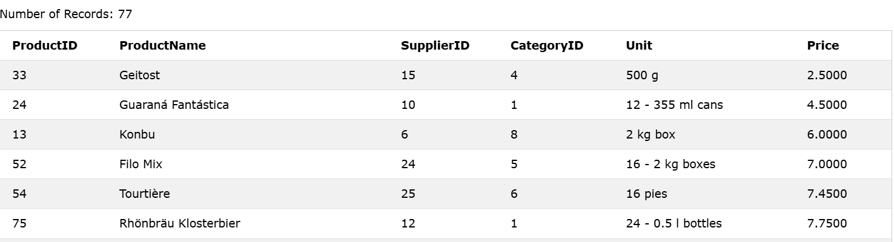
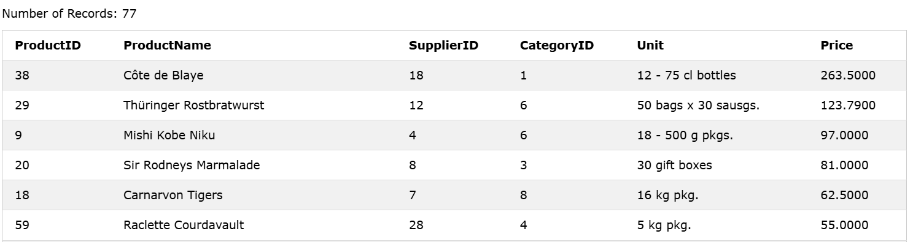
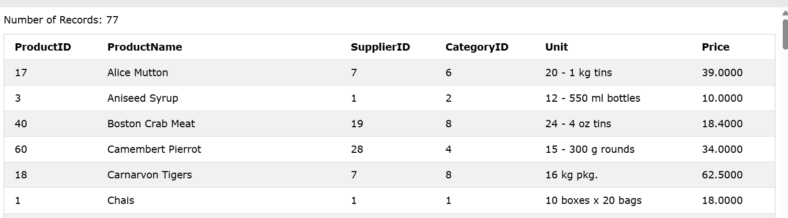
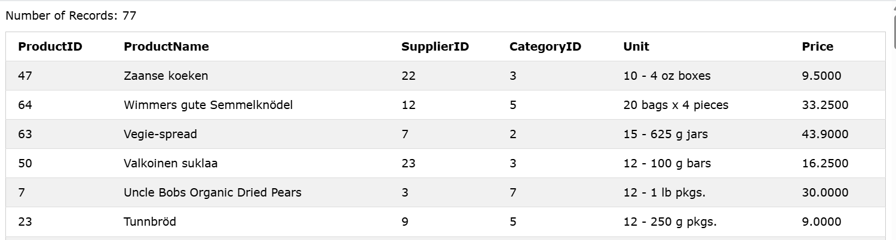
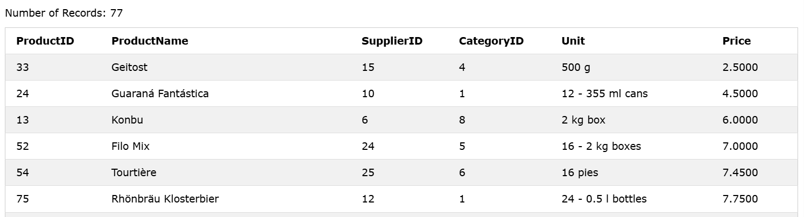
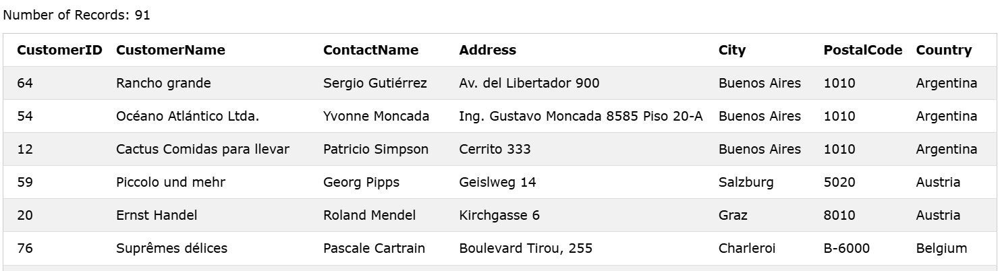

### The SQL ORDER BY
The `ORDER BY` keyword is used to sort the result-set in ascending or descending order.

### Syntax
```sql
SELECT column1, column2, ...
FROM table_name
ORDER BY column1, column2, ... ASC|DESC;
```

### Example
    -Sort the products by price:

```sql
SELECT * FROM Products ORDER BY Price;
```
OR 

```sql
SELECT * FROM Products ORDER BY Price ASC;
```

### Output


--------

### DESC
The ORDER BY keyword sorts the records in ascending order by default. To sort the records in descending order, use the `DESC` keyword.

```sql
SELECT * FROM Products ORDER BY Price DESC;
```

### Output


--------

### Alphabetically ASC
For string values the `ORDER BY` keyword will order alphabetically:

### Example
Sort the products alphabetically by ProductName:

```sql
SELECT * FROM Products ORDER BY ProductName;
```

### Output


--------


### Alphabetically DESC
To sort the table reverse alphabetically, use the DESC keyword:

### Example
Sort the products by ProductName in reverse order:

```sql
SELECT * FROM Products ORDER BY ProductName DESC;
```

### Output


--------


### ORDER BY Several Columns
The following SQL statement selects all products from the "products" table, sorted by the "Price" and the "SupplierID" column. This means that it orders by Price, but if some products have the same Price, it orders them by SupplierID:

### Example

```sql
SELECT * FROM Products ORDER BY Price,SupplierID;
```

### Output


--------


### Using Both ASC and DESC
The following SQL statement selects all customers from the "Customers" table, sorted ascending by the "Country" and descending by the "CustomerName" column:

### Example
```sql
SELECT * FROM Customers ORDER BY Country ASC, CustomerName DESC;
```

### Output


--------