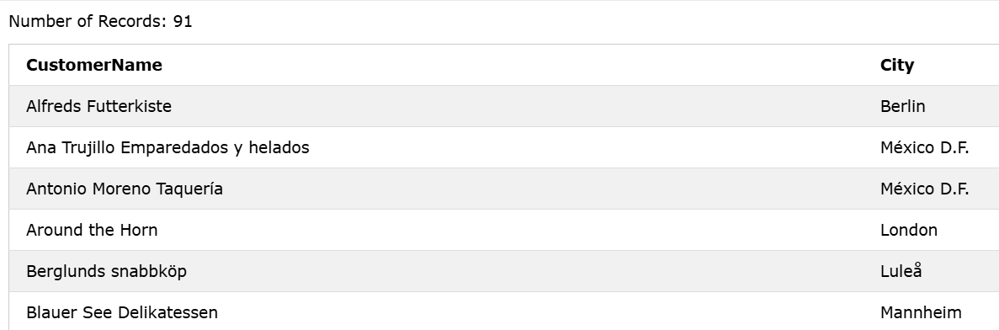

### The SQL SELECT Statement
The `SELECT` statement is used to select data from a database.

### Syntax
```sql
SELECT column1, column2, ...
FROM table_name;  
```  

### Exercise: Retrieve Customer Locations
Example: Return data from the Customers table:

```sql
SELECT CustomerName, City FROM Customers;
```

### Output: 
