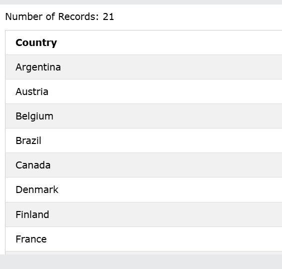

### The SQL SELECT DISTINCT Statement
The `SELECT DISTINCT` statement is used to return only distinct (different) values.

### Syntax
```sql
SELECT DISTINCT column1, column2, ...
FROM table_name;
```

### Example
    -Select all the different countries from the "Customers" table:

```sql
SELECT DISTINCT Country FROM Customers;
```

### Output


--------


### Count Distinct
By using the `DISTINCT` keyword in a function called `COUNT`, we can return the number of different countries.

### Example
```sql
SELECT COUNT(DISTINCT Country) FROM Customers;
```

### Output
