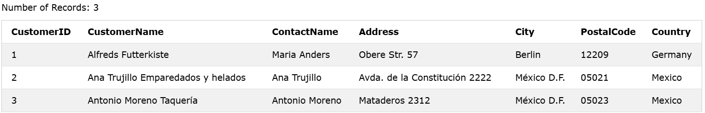

### The SQL SELECT TOP Clause
The `SELECT TOP` clause is used to specify the number of records to return.
The `SELECT TOP` clause is useful on large tables with thousands of records. Returning a large number of records can impact performance.

### Syntax

### SQL Server / MS Access Syntax:
```sql
SELECT TOP number|percent column_name(s)
FROM table_name
WHERE condition;  
```  

### MySQL Syntax:
```sql
SELECT column_name(s) FROM table_name
WHERE condition
LIMIT number;
```  

### Example:
```sql
SELECT TOP 3 * FROM Customers;

OR

SELECT * FROM Customers LIMIT 3;

```

### Output: 


---------