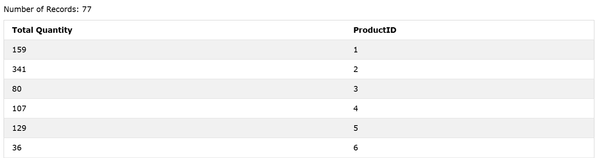

### The SQL SUM() Function
The `SUM()` function returns the total sum of a numeric column.

### Syntax
```sql
SELECT SUM(column_name) FROM table_name WHERE condition;
```  

### Example: 
Here we use the `SUM()` function and the `GROUP BY` clause, to return the `Quantity` for each `ProductID` in the OrderDetails table:
```sql
SELECT SUM(Quantity) AS [Total Quantity], ProductID FROM OrderDetails GROUP BY ProductID;
```

### Output: 
