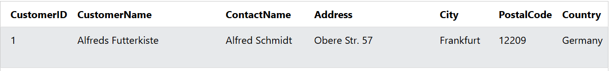
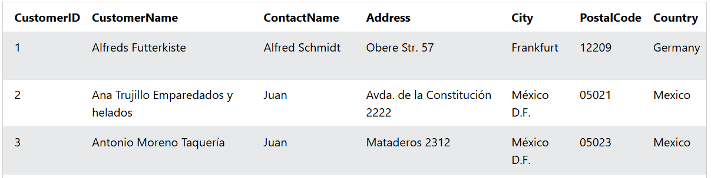

### The SQL UPDATE Statement
The UPDATE statement is used to modify the existing records in a table.

### Note: Be careful when updating records in a table! Notice the WHERE clause in the UPDATE statement. The WHERE clause specifies which record(s) that should be updated. If you omit the WHERE clause, all records in the table will be updated!

### Syntax
```sql
UPDATE table_name
SET column1 = value1, column2 = value2, ...
WHERE condition;
```  

### Example: The following SQL statement updates the first customer (CustomerID = 1) with a new contact person and a new city.

```sql
UPDATE Customers
SET ContactName = 'Alfred Schmidt', City= 'Frankfurt'
WHERE CustomerID = 1;
```

### Output: 


----------


### UPDATE Multiple Records
It is the WHERE clause that determines how many records will be updated.
The following SQL statement will update the ContactName to "Juan" for all records where country is "Mexico":

### Example: 
```sql
UPDATE Customers
SET ContactName='Juan'
WHERE Country='Mexico';
```

### Output: 


----------