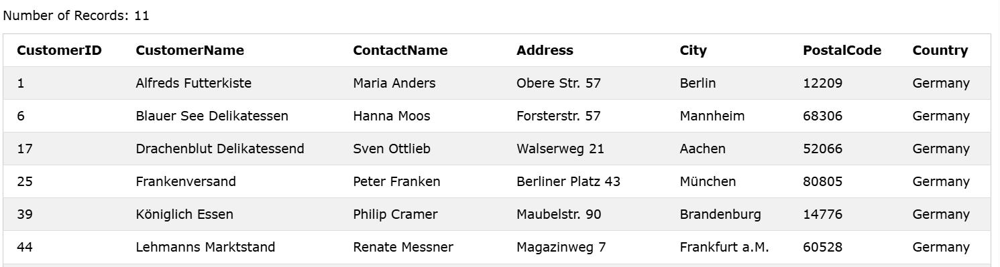
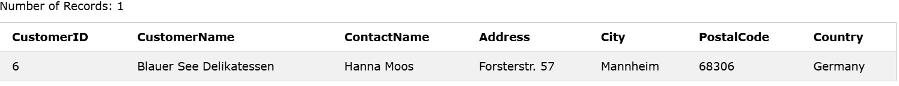
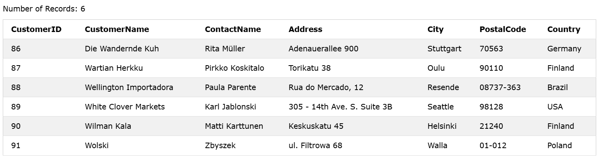
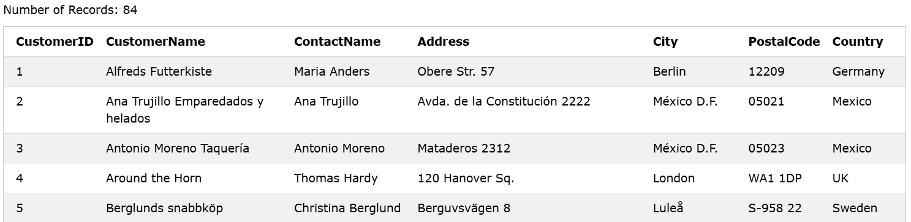
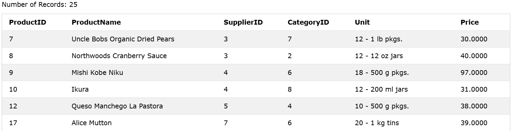
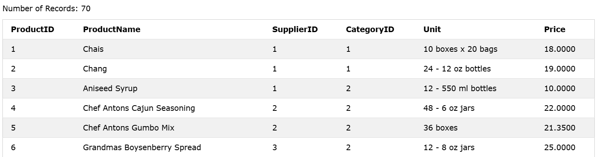
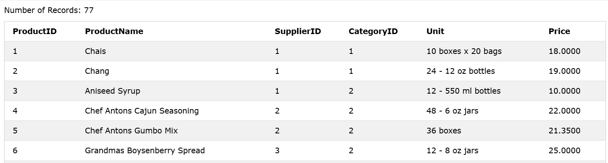
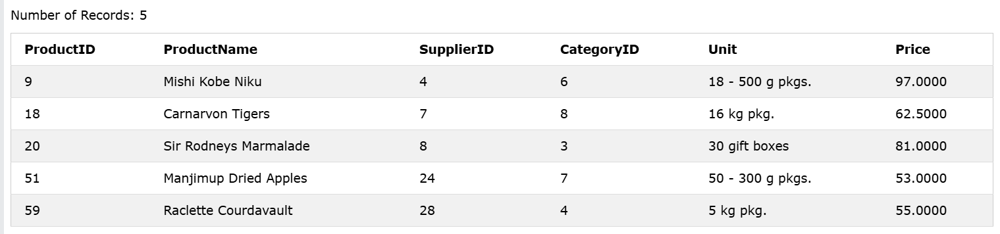
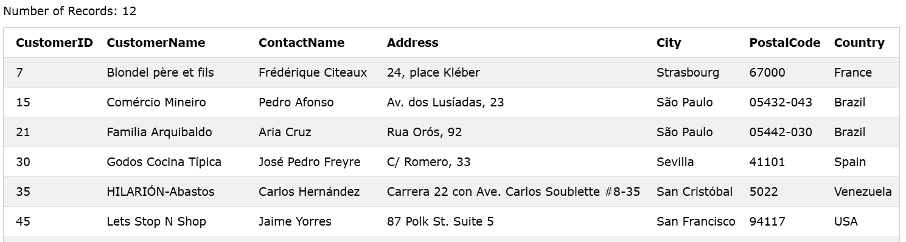
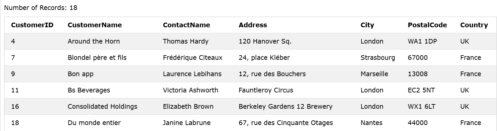

### The SQL WHERE Clause
The `WHERE` clause is used to filter records.
It is used to extract only those records that `fulfill a specified condition`.

### Syntax
```sql
SELECT column1, column2, ...
FROM table_name
WHERE condition;
```

### Example
    -Select all customers from Germany:

```sql
SELECT * FROM Customers WHERE Country='Germany';
```

### Output


------------------------------------------------


### Text Fields vs. Numeric Fields
SQL requires single quotes around text values (most database systems will also allow double quotes).
However, numeric fields should not be enclosed in quotes:

### Example
```sql
SELECT * FROM Customers
WHERE CustomerID=6;
```

### Output


------------------------------------------------


### Operators in The WHERE Clause
You can use other operators than the = operator to filter the search.

Operator	    Description	Example
=	            Equal	
>	            Greater than	
<	            Less than	
>=	            Greater than or equal	
<=	            Less than or equal	
<> || !=		Not equal.
BETWEEN	        Between a certain range	
LIKE	        Search for a pattern	
IN	            To specify multiple possible values for a column

### > Example
    -Select all customers with a CustomerID greater than 85:

```sql
SELECT * FROM Customers
WHERE CustomerID > 85;
```

### Output


-------

### < Example
    -Select all customers with a CustomerID less than 85:

```sql
SELECT * FROM Customers
WHERE CustomerID < 85;
```

### Output


-------


### >= Example
    -Select all products with a price greaterthan equal to 50:

```sql
SELECT * FROM Products WHERE Price >= 50;
```

### Output


-------


### <= Example
    -Select all products with a price lessthan equal to 50:

```sql
SELECT * FROM Products WHERE Price <= 50;
```

### Output


-------


### != Example
    -Select all products with a price Not equal to 50:

```sql
SELECT * FROM Products WHERE Price != 50;
```

### Output


-------


### <> Example
    -Select all products with a price Between 50 and 100:

```sql
SELECT * FROM Products WHERE Price BETWEEN 50 AND 100;
```

### Output


-------


### Like Example
    -Select all Customers whose city's name startswith 's': Note: `Like` Search for patterns

```sql
SELECT * FROM Customers WHERE City LIKE 's%';
```

### Output


-------


### IN Example
    -Select all Customers who Lives in France or UK: Note: `In` To specify multiple possible values for a column

```sql
SELECT * FROM Customers WHERE Country IN ('UK', 'France');
```

### Output


-------